# ქართული ასო-ფორმის დიზაინი
# შესავალი
ქართული ენის შენარჩუნება სუყველა ჩვენთაგანის პასუხისმგებლობაა. ერთ-ერთ ინფორმაციის, და ენის, დისტრიბუტორები ვართ ჩვენ, გრაფიკოსები. ამიტომ გვევალდებულება ხალხს დავეხმაროთ ინფორმაციის გადაცემაში და ასევე სწორად აღქმაში, ეს შეიძლება გამოიხატებოდეს გაზეთის, ვებ-გვერდის, წიგნის, რეკლამის, ან ნებისმიერი სხვა ფორმატის დიზაინით.

ამას ჭირდება დახვეწილი დიზაინი რომელიც ითვალისწინებს თითეულ ნაწილს—იერარქიას, ესთეტიკას, შესაფერის შრიფტს, განლაგებას, დამხმარე სურათს თუ ილუსტრაციას, და ასე შემდეგ—რომელსაც მხედველი ქვეცნობიერად აჯამებს და გამოყავს დასკვნა თუ რა განწყობის კომუნიკაციას ცდილობს ეს დიზაინი. წარმატებულ შემთხვევაში მკითხველის დასკვნა ემთხვევა დიზაინერის მიზანს, ნაკალებად შესაფერისი.

თუ გავითვალისწინებთ ჩვენ ქვეყანის მდგომარებოას როცა სხვაგან ხდებოდა ციფრული შრიფტების გამრავლება და ექსპერიმენტაცია 1980ანების დასასრულისკენ, სრულიად გასაგები ხდება თუ რატომ არის ქართველი გრაფიკოსი შეზღუდული როცა იგი ცდილობს შეარჩიოს კონკრეტული იერის ჩამომაყალიბელი შრიფტი.

არა და ჩვენ გვაქვს ძალიან საამაყო და ლამაზი კალიგრაფიური ისტორა, რომელმაც სამწუხაროდ ვერ მოახერხა თანამედროვე ტექნოლოგიებთან ერთად განვითარება. ეს პროექტი არის მცდელობა, რომ დაეწიოს ქართული შრიფტი თანამედროვე სტანდარტებს და პარალელურად ჩამოყალიბდეს სასწავლო რესურსი მოწაფე გრაფიკოსისთვის.

# ქართული დამწერლობა
ამ პროექტის ფარგლები არ შეიცავს ქართული კალიგრაფიის გარჩევას, ამის და მიუხედავად აუცილებელა განვიხილოთ ხელწერის განვითარება. ამით შევისწავლით თუ როგორ მივაღწიეთ დღევანდელ ასიოების ფორმებამდე, და როგორ გადაითარგმნა ხელნაწერი მექანიკურ ბეჭდვათ—სტამბიდან კომპიუტერულ შრიფტებამდე.

- ხუცური
	- ასომთავრული და ნუსხური, ერთბაშად სახელად ხუცური, ეგრეთვე "საეკლესიო ნაწერი"., ასომთავრული კი დიდი-ასოების ადგილზე.[^1]
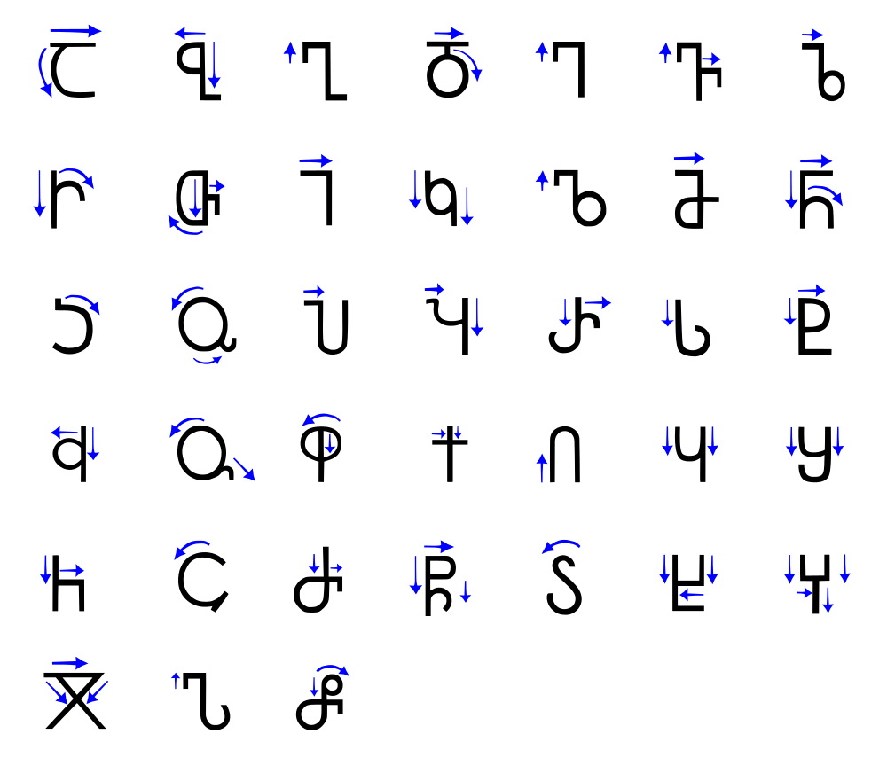
- ასომთავრული (მრგლოვანი/დამრგვალებული)
	- ჩამოყალიბდა ახ. წ. III-IV საუკუნეების შორის
		- ყველაზე ძველი ქართული ანბანი
		- გამოიყენებოდა საეკლესიო ნაწერებში
		- თითო ასო აგებულია ორი ფორმისგან—წრისგან და სწორი ხაზისგან.
		- წრეები და ხაზები ყოველთვის მართი კუთხით კავშირდებიან, ასო ჯ-ის გარდა
		- ყველა ასო-ნიშანი ერთი სიმაღლისაა
		- თითო ასოს დაწერას ხელის რამოდენიმე აღება ჭირდება.
		- ძირითად შესრულებული იყო ქვაზე, როამაული ტრაიანის მსგავსად.
		- IX-X საუკუნის ნაწერებში ჩანს  ჰორიზონტალურ და ვერტიკალურ ხაზების სისქის შორის სხვაობა, რომლიც მიგვანიშნებს რომ შესრულებული უყო ფართო თავიანი კალმით.
		- თავიდან სომთავრულ ნაწერში არ იყენებდნენ ჰარს.
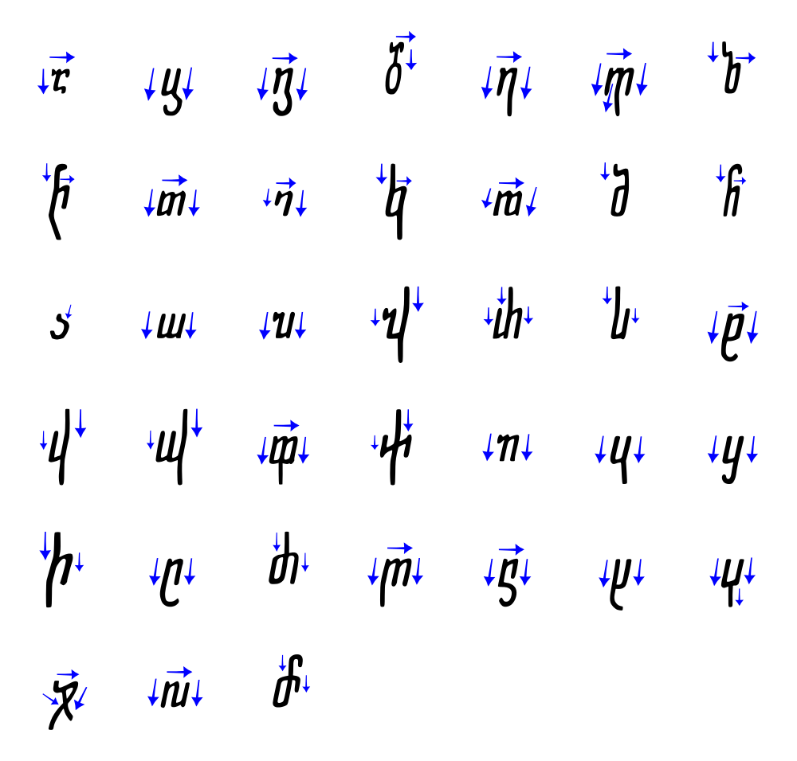
- ნუსხური (კუთხოვანი/პატარა ასო)
	- განვითარდა სადღაც IX საუკუნეში
		- გამოიყენებოდა მთავრულთან ერთად
		- ნუსხური დამწერლობა ასომთავრულის უკვე განვითარებული ფორმებიდან წარმოიშვა
		- კუთხოვანი, სწრაფი, მარჯვნივ გადახრილი დამწერლობაა

- მხედრული (საჯარო ნაწერი)
	- განვითარდა ხუცურიდან სწრაფი ხელნაწერით, არაბული დამწერლობის სტილისა და კალიგრაფიის ძლიერი ზეგავლენით.
	- ასოების ფორმები ვერტიკალზეა აგებული, ხოლო კონტურები კი მომრგვალებულია და ერთიან მონახაზს ქმნის.
	- ზოგმა ასო ნიშანმა (ს, ძ, მ) შეინაჩუნა ასომთავრული თვისებები.
# ასო-ფორმის ანატომია
კარგი ასო-ფორმების სახატავად, და ნებისმიერი დიზაინისთვის, საჭიროა მასზე საუბარი და კრიტიკულად გარჩევა. ამისთვის საჭიროა სპეციფიური ლექსიკონის შესწავლა, რომლის მეშვეობითაც შესაძლებელი იქნება ასო-ფორმის სპეციფიური დეტალის დასახელება და კონკრეტულად საუბარი.
## ლათინური ასო-ფორმა
სანამ ჩვენ ნაწერს შევისწავლით, შეგვიძლია მაგალითი ავიღოთ სხვა უფრო დამყარებულ და შესწავლილ ანბანიდან. ერთ-ერთი ყველაზე ანალიზირებული არის ლათინური შრიფტი.
> Hamburgerfontsiv[^2]

|  მაგალითი  |  სახელი  |  ინგლისურად  |
|---------|--------------|---------------|
| 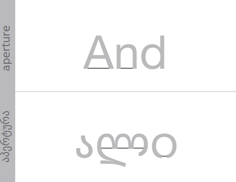  |  აპერტურა/ხვრელი  |  Aperture  |
| 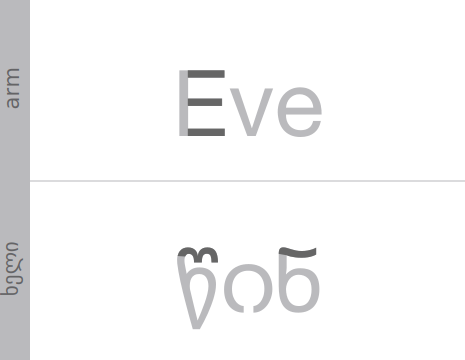  |  ხელი  |  Arm  |
|   |  აღმავალი  |  Ascender  |
| 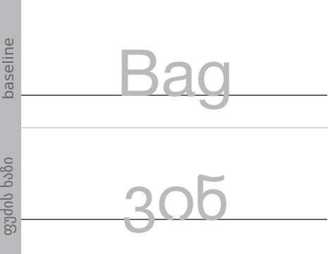  |  ფუძის ხაზი  |  Baseline  |
| 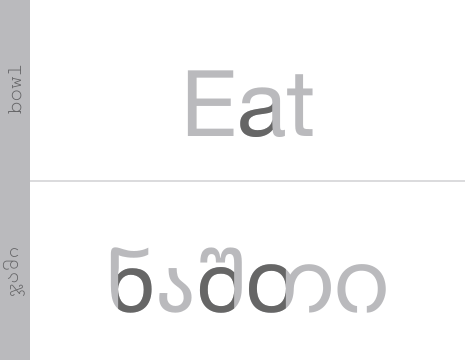  |  თასი  |  Bowl  |
|   |  შემხვედრი  |  Counter  |
| 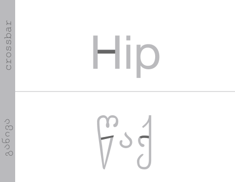  |  განივა  |  Crossbar  |
| 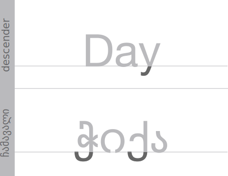  |  ჩამავალი  |  Descender  |
| 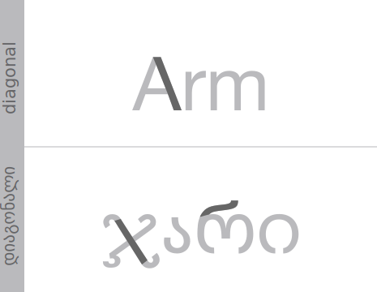  |  დაიგონალური ხაზი  |  Diagonal Stroke  |
| 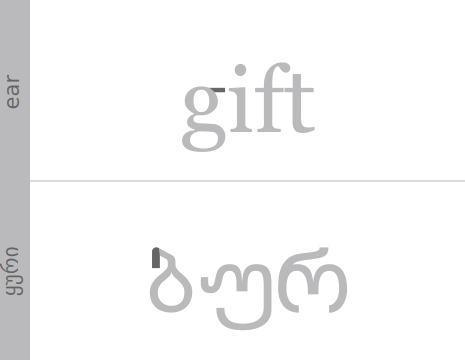  |  ყური  |  Ear  |
|   |  ფინიალი  |  Finial  |
| 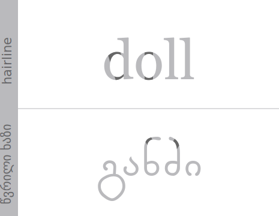  |  წვრილი ხაზი  |  Hairline  |
| 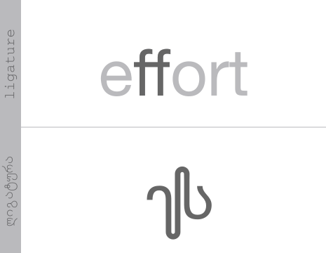  |  ლიგატურა  |  Ligature  |
| 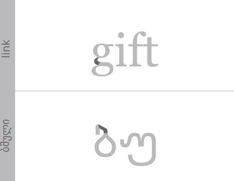  |  დამაკავშირებელი  |  Link  |
| 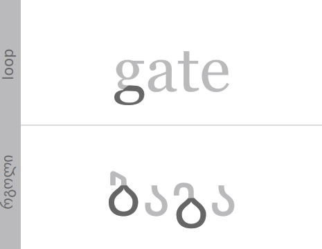  |  რგოლი  |  Loop  |
| 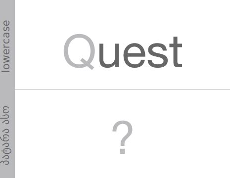  |  ქვედა/პატარა ასო  |  Lowercase  |
|   |  სერიფი  |  Serif  |
| 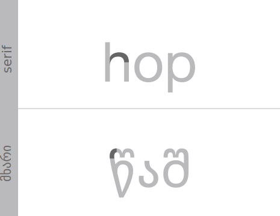  |  მხარი  |  Shoulder  |
| 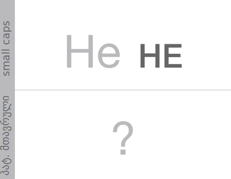  |  პატარა ასომთავრული  |  Small Caps  |
| 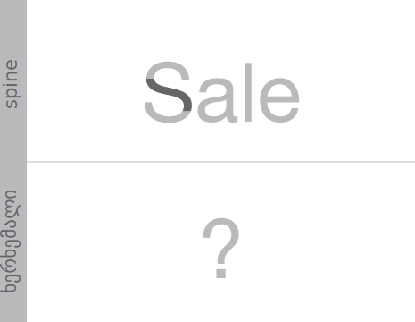  |  ხერხემალი  |  Spine  |
| 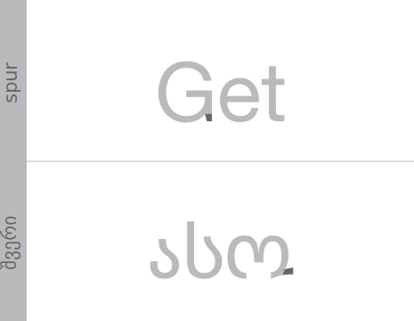  |  შვერი/შტო  |  Spur  |
| 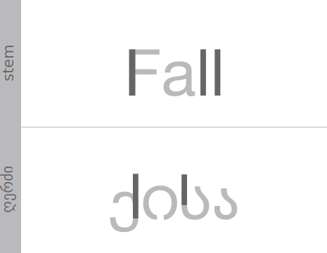  |  ღერძი  |  Stem  |
| 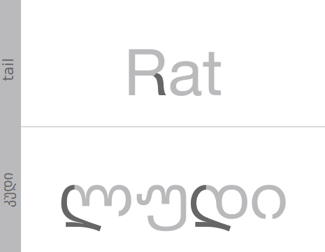  |  კუდი  |  Tail  |
| 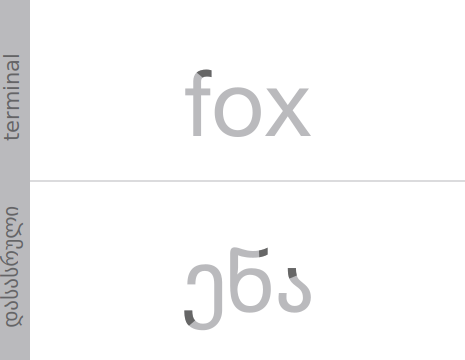  |  დასასრული  |  Terminal  |
| 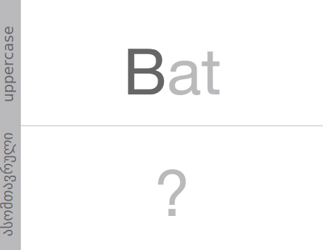  |  ასომთავრული  |  Uppercase  |
| 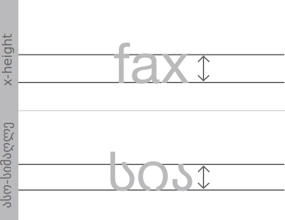  |  ასო-სიმაღლე  |  x-height  |

# კლასიფიკაცია
კლასიფიკაცია შედარებით ბუნდოვანი საკითხია და არ არსებობს ობიექტური კატეგორიები, ამის მიუხედავად არის რამოდენიმე ძირითადი შეთანხმებული კატეგორია.
- Blackletter (შავასოვანი)
- Serif (სერიფი?)
	- Transitional (გადამავალი)
	- Oldstyle (ძველებური)
	- Slab/Egyptian (ეგვიპტური)
	- Neoclassical (ნეოკლასიკური)
	- Free (თავისუფალი)
- Sans-Serif (სანს-სერიფი)
	- Humanist (ჰუმანიური)
	- Geometric (გეომეტრიული)
	- Grotesk/Grotesque (გრეტესკ)
	- Gothic (გოთიკური)
	- Free (თავისუფალი)
- Script/Display (/გამოსაფენი)
	- Handwritten (ხელნაწერი)
	- Lettering (კალიგრაფიული)
	- Copperplate ()
## მხედრული ასო-ფორმა
საქმის გასამარტივებლად და საერთაშორისო დიზაინერებთან საურთიერთოდ, შეგვიძლია ბევრი რამ ლათინური შრიფტიდან მივანიჭოდ ჩვენ ასო-ფორმებს.

შეგვიძლია ასოები დავაჯგუფოთ ერთნაირი ზოგადი ფორმებით ან დამწერლობის ხელის მოძრაობით
- ეუ ვკ ჟყ ქჭ
- იორ თფ დლღ
- ნმშწ ზხძ ჩ
- აპჰ ს
- ბ გ ტ ც
- ჯ
აქედან გამომდინარე, შემდეგი ასოებიდან შეგვიძლია ავიღოთ ნაწილები, რომლითაც შესაძლებელი იქნება დანარჩენი ასო-ფორმების დახატვა და შრიფტის იერის გამოხატვა.
> ჯამწერლქუჩგადაკეფიტა

ჯანწერლადტუჩყაფეჭიქა
ჯანდამწერლობგაფარჭყვეტიქა
# რესურსები
[http://luc.devroye.org/georgia.html](http://luc.devroye.org/georgia.html)

[http://www.aboutgeorgia.ge/language/alphabet.html](http://www.aboutgeorgia.ge/language/alphabet.html)

[https://georgiasomethingyouknowwhatever.wordpress.com/](https://georgiasomethingyouknowwhatever.wordpress.com/)

[http://www.wazu.jp/gallery/Fonts\_Georgian.html](http://www.wazu.jp/gallery/Fonts_Georgian.html)

[http://www.ancientscripts.com/georgian.html](http://www.ancientscripts.com/georgian.html)

[http://typedia.com/learn/only/anatomy-of-a-typeface/](http://typedia.com/learn/only/anatomy-of-a-typeface/)

[http://www.typogui.de](http://www.typogui.de)

[http://practice.typekit.com](http://practice.typekit.com)

[https://developers.google.com/web/fundamentals/](https://developers.google.com/web/fundamentals/)

[^1]:	[http://www.aboutgeorgia.ge/language/alphabet.html](http://www.aboutgeorgia.ge/language/alphabet.html)

[^2]:	"Hamburgerfontsiv" გამოიყენება რადგან იგი შეიცავს ფორმებს, რომლისგანაც შესაძლებელია დანარჩენი ანბანის შესრულება, და ამასთანავე ვერტიკალების ასვლა-ჩასვლა ახლოა ტიპიურ ინგლისურ სიტყვასთან.
